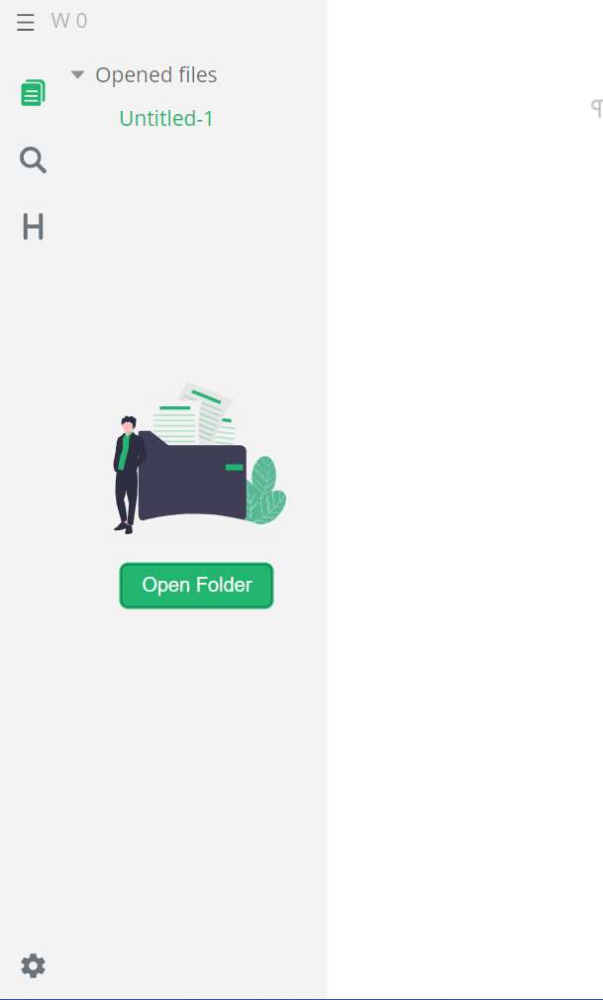

[< Tilbake](index.md)

## Brukelige innstillinger og funksjoner i marktext

### Sidepanel

**Trykk `CTRL + J`**

### Bildemappe

**Gå til innstillinger med f.eks tannhjulet i sidepanelet**

**Velg Image**

### Legg inn bilde

**Ta et skjermbilde med f.eks `SHIFT + WINDOWS + S`**

**Lim inn bilde**

### Redigere bilde filbane

**Trykk på et bilde og velg Edit Image**

**Fiks filbanen**

