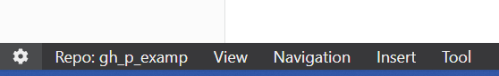
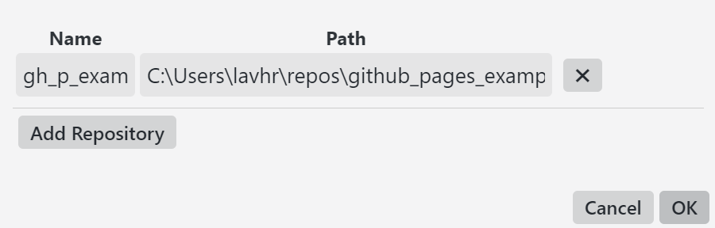
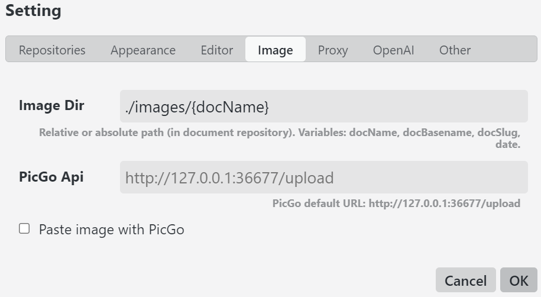
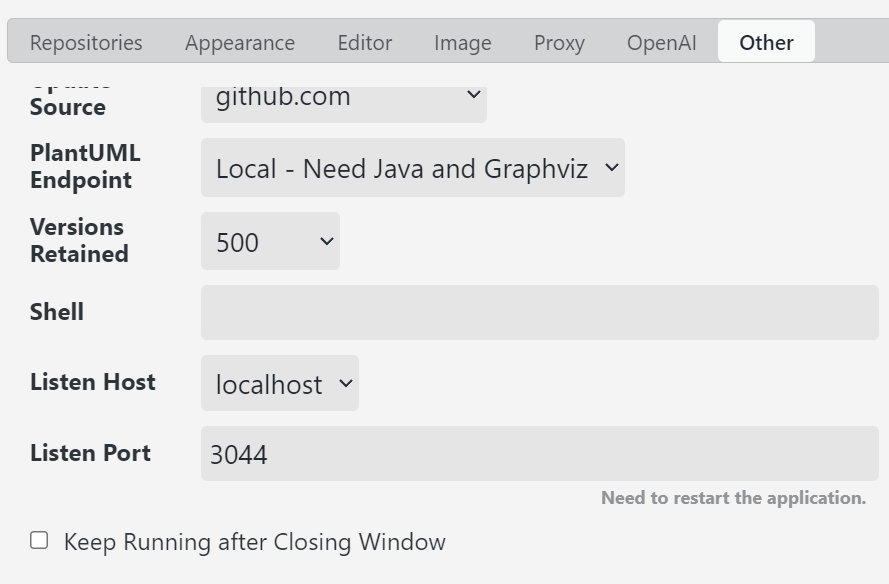

[< Tilbake](index.md)

## Brukelige innstillinger og funksjoner i Yank Note

**Gå inn i innstillinger med å trykke tannhjulet i venstre hjørnet.**

### Legge til mappe

**Trykk Path**
**Velg mappen du skal bruke**
**Skriv inn et navn**

### Bildemappe

**Trykk Image**
**Skriv inn lagringsplassering i `Image dir`**

_Anbefaler å bruke `./images/`_

### Legge inn bilde

**Ta et skjermbilde med f.eks `SHIFT + WINDOWS + S`**

**Lim inn bilde**

### Lukk programmet når vinduet er lukket

**Trykk Other**
**Bla ned og fjern hakket fra `Keep Running after Closing Window`**

